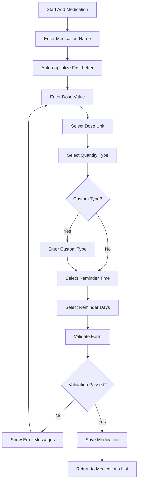

# Medication Form UI/UX Redesign Design Document

## Overview

This document outlines the comprehensive redesign of the medication form interface for the Pildhora app, focusing on native React Native components, improved data structure, and enhanced user experience for caregivers and patients.

## Current State Analysis

### Existing Implementation
- The current form combines dose and quantity in a single field (`dosage: "500mg, Tablets"`)
- Uses basic React Native components with TailwindCSS styling
- Limited validation for dose and quantity inputs
- Text-based time input instead of native time picker
- Modal-based medication type selection

### Issues Identified
1. Data integrity concerns with combined dose/quantity field
2. Inconsistent user experience across platforms
3. Limited accessibility features
4. No support for dose unit selection
5. Manual time input prone to errors

## New Data Model

### Updated Medication Interface

```typescript
export interface Medication {
  id: string;
  name: string;
  doseValue: string;        // Numeric value only (e.g., "500", "10", "0.5")
  doseUnit: string;          // Unit (e.g., "mg", "ml", "g", "mcg")
  quantityType: string;       // Form factor (e.g., "Tablets", "Capsules", "Liquid")
  isCustomQuantityType: boolean; // Flag for custom quantity types
  frequency: string;         // Days of week (unchanged)
  times: string[];           // Reminder times (unchanged)
  patientId: string;
  caregiverId: string;
  createdAt: Date | string;
  updatedAt: Date | string;
}
```

### Dose Units Enumeration

```typescript
export const DOSE_UNITS = [
  { id: 'mg', label: 'mg (milligrams)' },
  { id: 'g', label: 'g (grams)' },
  { id: 'mcg', label: 'mcg (micrograms)' },
  { id: 'ml', label: 'ml (milliliters)' },
  { id: 'l', label: 'l (liters)' },
  { id: 'units', label: 'units' },
  { id: 'drops', label: 'drops' },
  { id: 'sprays', label: 'sprays' },
  { id: 'puffs', label: 'puffs' },
  { id: 'custom', label: 'Custom unit' }
] as const;
```

### Quantity Types Enumeration

```typescript
export const QUANTITY_TYPES = [
  { id: 'tablets', label: 'Tablets', icon: 'medkit-outline' },
  { id: 'capsules', label: 'Capsules', icon: 'medkit-outline' },
  { id: 'liquid', label: 'Liquid', icon: 'flask-outline' },
  { id: 'cream', label: 'Cream', icon: 'color-wand-outline' },
  { id: 'inhaler', label: 'Inhaler', icon: 'wind-outline' },
  { id: 'drops', label: 'Drops', icon: 'water-outline' },
  { id: 'spray', label: 'Spray', icon: 'snow-outline' },
  { id: 'other', label: 'Other', icon: 'help-circle-outline' }
] as const;
```

## Component Architecture

### Form Component Hierarchy

```
MedicationForm (Container)
├── MedicationNameInput
├── DoseInputContainer
│   ├── DoseValueInput
│   └── DoseUnitSelector
├── QuantityTypeSelector
├── ReminderTimePicker
├── ReminderDaysSelector
└── FormActions
    ├── SaveButton
    └── CancelButton
```

### Component Responsibilities

#### MedicationForm (Container)
- Manages form state and validation
- Handles form submission
- Coordinates data migration for existing records
- Manages error states and user feedback

#### MedicationNameInput
- Text input with auto-capitalization
- Real-time validation for medication names
- Accessibility support with proper labels

#### DoseInputContainer
- Contains dose value and unit selection
- Manages the relationship between value and unit
- Provides validation for numeric input

#### DoseValueInput
- Numeric-only keyboard input
- Real-time validation
- Support for decimal values
- Accessibility hints for dose input

#### DoseUnitSelector
- Native picker for unit selection
- Custom unit option with text input
- Proper localization support

#### QuantityTypeSelector
- Tag-based selection interface
- Custom type creation capability
- Visual feedback with icons
- Delete functionality for selected types

#### ReminderTimePicker
- Native time picker component
- Multiple time selection support
- 24-hour format option
- Clear time formatting display

#### ReminderDaysSelector
- Toggle button interface (maintaining current approach)
- Visual feedback for selected days
- Accessibility support
- Quick selection options (weekdays, weekends, all)

## UI/UX Flow

### User Interaction Flow



### Screen Layout

1. **Header Section**
   - Title: "Add Medication" / "Edit Medication"
   - Back navigation button

2. **Form Sections** (in scrollable container)
   - Medication Name (text input)
   - Dose Input (value + unit selector)
   - Quantity Type (tag selector)
   - Reminder Time (native time picker)
   - Reminder Days (toggle buttons)

3. **Action Section**
   - Save button (primary action)
   - Cancel button (secondary action)

## Native React Native Components

### Core Components to Use

1. **TextInput**
   - For medication name and dose value
   - With appropriate keyboard types
   - Auto-capitalization for name field

2. **Picker**
   - For dose unit selection
   - Native iOS/Android picker appearance
   - Custom styling to match app theme

3. **DateTimePicker**
   - For time selection
   - Platform-specific time picker
   - 24-hour format support

4. **TouchableOpacity**
   - For quantity type selection
   - Day selection toggles
   - Form action buttons

5. **Modal**
   - For custom quantity type input
   - Confirmation dialogs
   - Error message display

6. **ScrollView**
   - For form content
   - Keyboard-aware scrolling
   - Proper content insets

7. **ActivityIndicator**
   - Loading states during form submission
   - Data migration operations

### Platform-Specific Considerations

#### iOS
- Use `PickerIOS` for dose unit selection
- Implement native iOS time picker modal
- Leverage haptic feedback for interactions
- Use iOS-style navigation patterns

#### Android
- Use Android Material Design picker
- Implement Material time picker dialog
- Add ripple effects to touchable elements
- Follow Android navigation patterns

## Validation Strategy

### Input Validation Rules

1. **Medication Name**
   - Required field
   - Minimum 2 characters
   - Maximum 100 characters
   - No special characters (except hyphens)

2. **Dose Value**
   - Required field
   - Numeric only (positive numbers)
   - Maximum 10 digits
   - Support for decimal values (max 2 decimal places)

3. **Dose Unit**
   - Required selection
   - Must be from predefined list or valid custom input

4. **Quantity Type**
   - Required selection
   - Must be from predefined list or valid custom input

5. **Reminder Time**
   - Required field
   - Valid time format (HH:MM)
   - 24-hour format validation

6. **Reminder Days**
   - At least one day must be selected
   - Valid day identifiers

### Validation Implementation

```typescript
interface ValidationResult {
  isValid: boolean;
  errors: {
    name?: string;
    doseValue?: string;
    doseUnit?: string;
    quantityType?: string;
    reminderTime?: string;
    reminderDays?: string;
  };
}

const validateMedicationForm = (form: FormState): ValidationResult => {
  const errors: ValidationResult['errors'] = {};
  
  // Name validation
  if (!form.name.trim()) {
    errors.name = 'Medication name is required';
  } else if (form.name.length < 2) {
    errors.name = 'Name must be at least 2 characters';
  }
  
  // Dose validation
  if (!form.doseValue.trim()) {
    errors.doseValue = 'Dose value is required';
  } else if (!/^\d*\.?\d{0,2}$/.test(form.doseValue)) {
    errors.doseValue = 'Please enter a valid dose value';
  }
  
  // Unit validation
  if (!form.doseUnit) {
    errors.doseUnit = 'Please select a dose unit';
  }
  
  // Quantity type validation
  if (!form.quantityType) {
    errors.quantityType = 'Please select a medication type';
  }
  
  // Time validation
  if (!form.reminderTime) {
    errors.reminderTime = 'Please select a reminder time';
  } else if (!/^([01]?[0-9]|2[0-3]):[0-5][0-9]$/.test(form.reminderTime)) {
    errors.reminderTime = 'Please enter a valid time';
  }
  
  // Days validation
  if (form.reminderDays.length === 0) {
    errors.reminderDays = 'Please select at least one day';
  }
  
  return {
    isValid: Object.keys(errors).length === 0,
    errors
  };
};
```

### Error Handling

1. **Real-time Validation**
   - Validate on blur for each field
   - Show inline error messages
   - Prevent submission with errors

2. **Submission Validation**
   - Comprehensive validation before save
   - Show summary of all errors
   - Focus on first error field

3. **Accessibility Support**
   - Screen reader announcements for errors
   - Proper ARIA labels
   - High contrast error indicators

## Migration Approach

### Data Migration Strategy

1. **Backward Compatibility**
   - Maintain support for existing `dosage` field format
   - Detect and parse legacy data on load
   - Gradual migration to new format

2. **Migration Logic**

```typescript
const migrateMedicationData = (medication: any): Medication => {
  // Check if already migrated
  if (medication.doseValue && medication.doseUnit) {
    return medication as Medication;
  }
  
  // Parse legacy dosage format
  if (medication.dosage && medication.dosage.includes(',')) {
    const [dosePart, quantityPart] = medication.dosage.split(',').map(s => s.trim());
    
    // Extract dose value and unit
    const doseMatch = dosePart.match(/^([\d.]+)\s*([a-zA-Z%]+)?$/);
    const doseValue = doseMatch?.[1] || dosePart;
    const doseUnit = doseMatch?.[2] || 'mg';
    
    return {
      ...medication,
      doseValue,
      doseUnit,
      quantityType: quantityPart || 'Tablets',
      isCustomQuantityType: !QUANTITY_TYPES.some(t => t.label === quantityPart)
    };
  }
  
  // Fallback for unknown formats
  return {
    ...medication,
    doseValue: medication.dosage || '',
    doseUnit: 'mg',
    quantityType: 'Tablets',
    isCustomQuantityType: false
  };
};
```

3. **Database Migration**
   - Batch update existing records
   - Maintain backup of original data
   - Rollback capability if needed

4. **Client-Side Migration**
   - Migrate on-the-fly when loading
   - Update format when saving
   - Transparent to users

### Implementation Steps

1. **Phase 1: Backend Preparation**
   - Update Firestore rules to accept new fields
   - Create migration script for existing data
   - Test with sample data

2. **Phase 2: Frontend Implementation**
   - Implement new form components
   - Add migration logic to data loading
   - Update form submission to use new fields

3. **Phase 3: Data Migration**
   - Run migration script on production data
   - Verify data integrity
   - Monitor for issues

4. **Phase 4: Cleanup**
   - Remove legacy dosage field support
   - Clean up migration code
   - Update documentation

## Accessibility Considerations

1. **Screen Reader Support**
   - Proper labels for all form elements
   - Announce validation errors
   - Navigation order consistency

2. **Visual Accessibility**
   - High contrast colors
   - Large touch targets (minimum 44x44 points)
   - Clear focus indicators

3. **Motor Accessibility**
   - Large tap targets for buttons
   - Sufficient spacing between elements
   - Gesture alternatives for all actions

4. **Cognitive Accessibility**
   - Clear, simple language
   - Consistent layout and interactions
   - Error prevention and recovery

## Performance Considerations

1. **Component Optimization**
   - Memoize expensive computations
   - Optimize re-renders with React.memo
   - Lazy load non-critical components

2. **Data Handling**
   - Efficient form state management
   - Debounced validation
   - Optimized data migration

3. **Bundle Size**
   - Tree-shake unused components
   - Optimize imports
   - Code splitting for large components

## Testing Strategy

1. **Unit Testing**
   - Component rendering
   - Validation logic
   - Data migration functions

2. **Integration Testing**
   - Form submission flow
   - Data persistence
   - Cross-component interactions

3. **Accessibility Testing**
   - Screen reader compatibility
   - Keyboard navigation
   - Color contrast compliance

4. **User Testing**
   - Usability testing with target users
   - A/B testing for critical interactions
   - Feedback collection and iteration

## Conclusion

This redesign provides a comprehensive solution to the medication form challenges in the Pildhora app. By separating dose and quantity fields, implementing native components, and improving the overall user experience, we create a more robust and accessible interface for caregivers and patients.

The migration strategy ensures a smooth transition from the existing implementation while maintaining data integrity and minimizing disruption to users. The component architecture allows for future enhancements and maintains consistency with the overall app design.

The focus on native React Native components ensures optimal performance and platform-specific user experience, while the comprehensive validation strategy prevents data entry errors and improves the reliability of medication information.